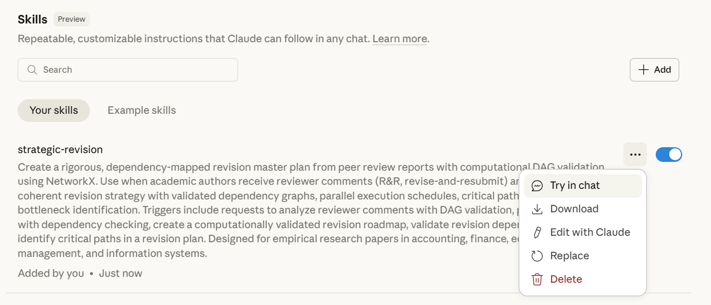
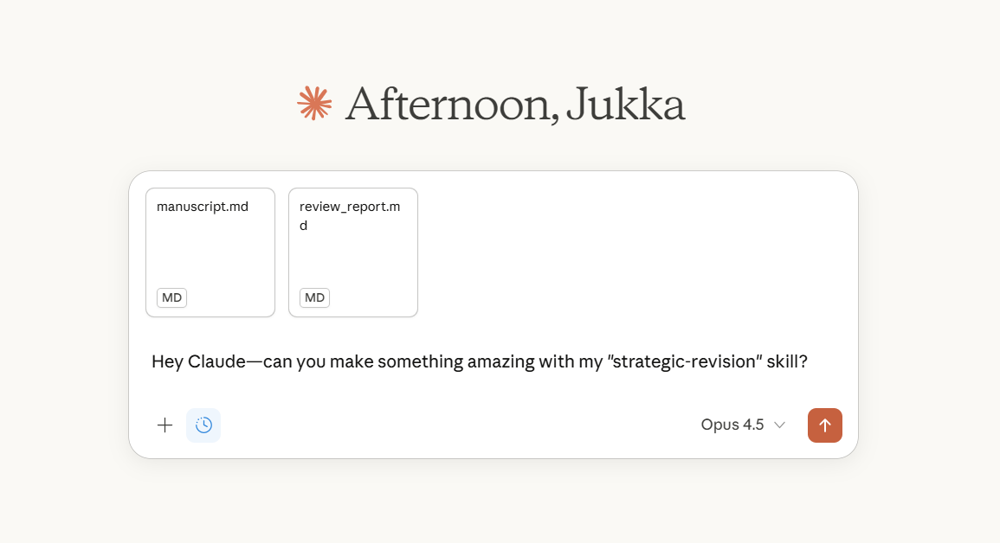

# strategic-revision

A Claude Code skill that turns peer review reports into structured revision roadmaps. Extracts every reviewer request as a separate task, maps dependencies as a directed acyclic graph, validates the graph computationally with NetworkX, and sequences work into execution blocks with co-author assignments and decision points.

## Trigger

Invoke with `/strategic-revision` or any request to create a revision plan with DAG validation from peer review reports.

## Installation

1. Download the `strategic-revision.skill` file from this repository
2. In Claude Code, go to **Settings → Capabilities → Skills → Add** and upload the `.skill` file



## Input Requirements

The skill requires two inputs, placed in the working directory or provided when prompted:

1. **Peer review reports** — verbatim reports from each reviewer and the editor. Any format (PDF, Word, plain text). Provide the full unedited text; the skill traces every task back to a specific reviewer quote, so summaries are insufficient.
2. **Original manuscript** — the submitted version under review. The full manuscript is preferred; at minimum, the abstract and section structure are needed for dependency mapping.



## What It Does

Analyzes reviewer comments and the manuscript to produce a structured revision roadmap with:

- **Atomic task extraction** — parses each reviewer comment into separate actionable tasks with verbatim quotes, preventing details from being overlooked
- **Classification** by type (empirical, argumentative, structural, clarification, editorial)
- **Dependency mapping** as a directed acyclic graph, catching sequencing errors before work begins
- **Computational validation** — acyclicity checks, parallel batches, critical path analysis, and bottleneck identification (surfaces tasks that block the most downstream work)
- **Execution blocks** with GO/NO-GO decision points and explicit co-author sync points

## Workflow

| Phase | Name | Purpose |
|-------|------|---------|
| 1 | Atomic Parsing | Extract every distinct request as a separate task |
| 2 | Classification | Tag each task by category |
| 3 | Dependency Mapping | Build the DAG of task dependencies |
| 3b | Structural Validation | Confirm the graph is acyclic before sequencing |
| 4 | Critical Path Sequencing | Group tasks into execution blocks |
| 5 | Risk & Conflict Resolution | Identify reviewer conflicts and process risks |
| 6 | Computational Optimization | Run full NetworkX analysis and refine the roadmap |

## Files

```
strategic-revision/
├── SKILL.md                              # Skill definition and workflow
├── scripts/
│   └── dag_validator.py                  # NetworkX validation script
└── references/
    ├── phases.md                         # Phases 1-5 (including 3b) instructions
    ├── phase6-dag-validation.md          # Phase 6 optimization instructions
    └── task-schema.md                    # JSON schema for revision_tasks.json
```

👉 **Claude Code users!** Requires Python 3 and `networkx` (`pip install networkx`).

## Limitations

- **No effort estimation.** Tasks are sequenced by dependency, not by expected effort. A task requiring two hours and one requiring two weeks are treated equally.
- **No strategic pushback guidance.** The skill extracts and organizes all reviewer requests but does not flag candidates where "we respectfully disagree" may be the appropriate response.
- **Dependency mapping requires user judgment.** The tool validates DAG structure but does not generate dependencies automatically. Different users may construct different graphs from the same reviews.
- **No response letter integration.** The plan organizes tasks but does not generate response letter text or track task-to-reviewer mappings for the letter.
- **Static plan.** If early tasks change results substantially, the plan does not update automatically. Replanning is manual.
- **Empirical paper template.** The A-to-E execution block structure fits empirical accounting and finance papers. It may not suit qualitative, theoretical, or interdisciplinary work without adaptation.

## Intended Use

Designed for initial planning and co-author coordination at the start of a revise-and-resubmit. Not a substitute for execution tracking or adaptive replanning. A practical workflow: use this skill to produce the revision roadmap, then migrate to a simpler checklist for daily work.
